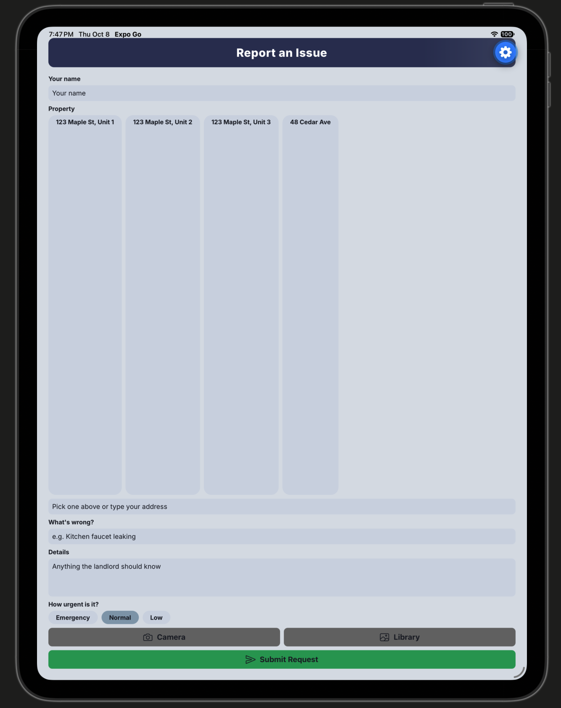
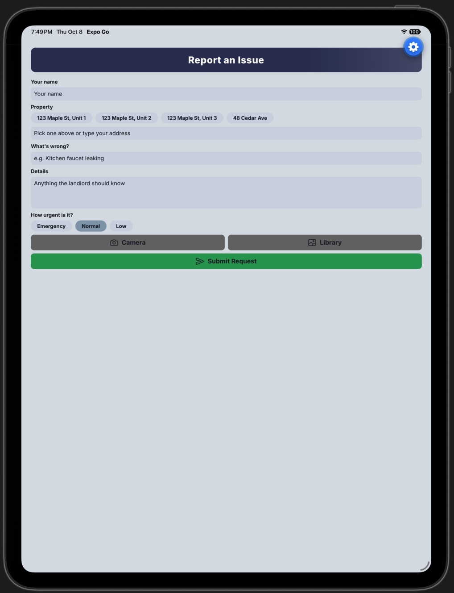
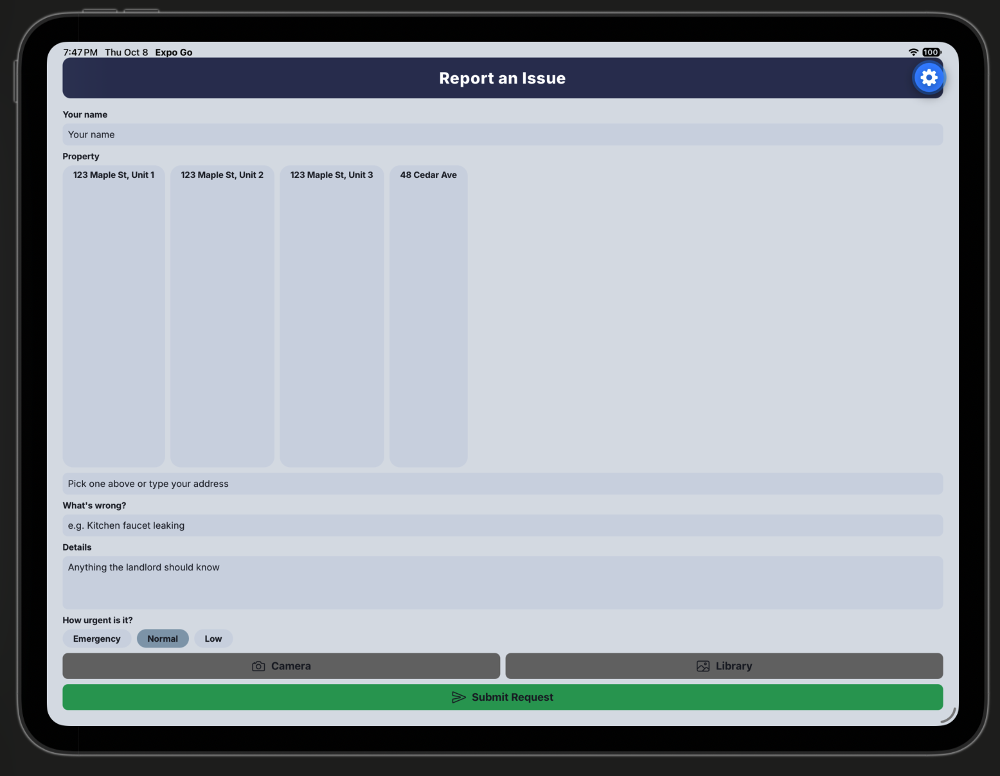
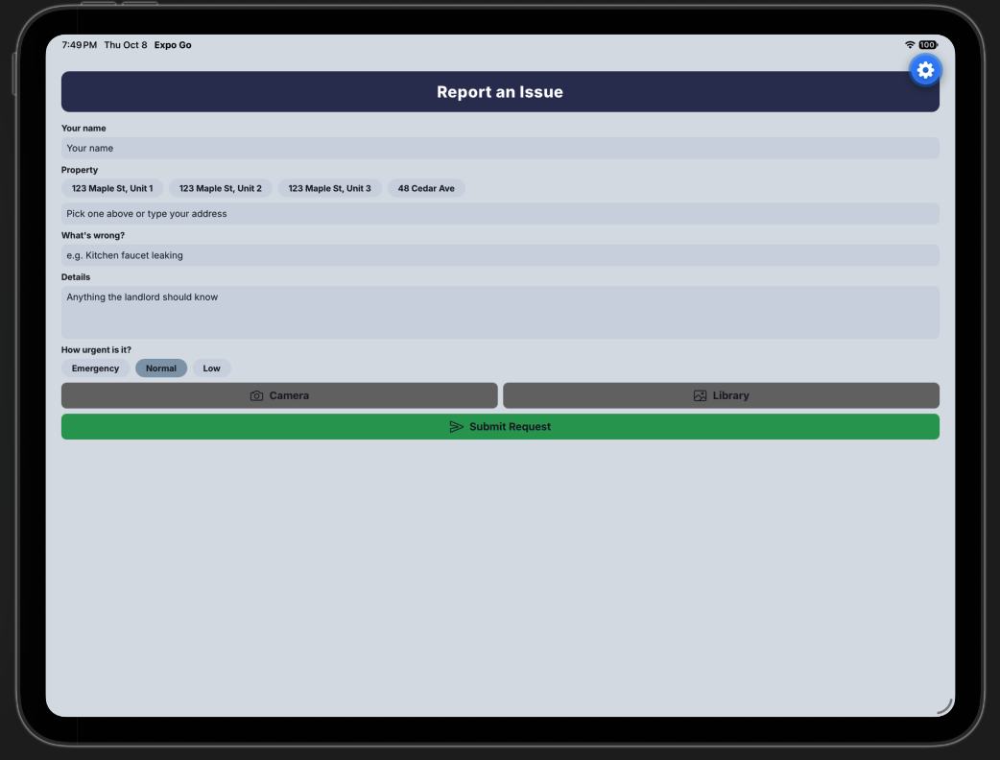

# Rent Well: NewWorkOrderScreen audit

Mobile Development assignment. I audited the tenant "Report an Issue" screen (`screens/NewWorkOrderScreen.js`) on two device sizes and in two orientations, then fixed what broke.

## Devices tested
- Small phone: iPhone SE (iOS simulator)
- Tablet: iPad (iOS simulator)
- Portrait and landscape on each

## What I found and fixed

### 1. Safe area insets
The app hides the navigation header, so nothing kept the screen clear of the notch, status bar, or home indicator, and the title was pressed against the top. I used `useSafeAreaInsets` from `react-native-safe-area-context` and added each inset to the screen's normal padding. The top and bottom insets clear the status bar and home indicator, and the left and right insets keep content away from the notch in landscape.

### 2. Keyboard handling
The form was a plain `View`, so the keyboard could cover the Details field and the Submit button with no way to scroll to them. I wrapped the form in a `KeyboardAvoidingView` with a `ScrollView` inside, so the screen makes room for the keyboard and every field can be reached. `keyboardShouldPersistTaps="handled"` lets a tap on a chip or button work on the first try while the keyboard is open.

### 3. Layout with useWindowDimensions
On the iPad the form stretched edge to edge, and in landscape on the iPhone SE the photo preview took up most of the short screen. I capped the form at 600 wide and centered it so it reads like a phone layout on a tablet. I used `useWindowDimensions` to check whether the screen is wider than it is tall, and in that case the photo preview shrinks from 160 to 120 tall.

### Platform.OS
I used `Platform.OS` for the `KeyboardAvoidingView` behavior. iOS does not resize the app when the keyboard opens, so it needs `padding`, while Android already moves the content up on its own, so the behavior is left unset there (this follows the Expo keyboard handling guide).

### Other changes
Before these three fixes, I made two smaller changes: a first version of the top inset fix for the title, and a fix for the property chip row, which was stretching to fill the spare height and making the chips too tall (setting `flexGrow: 0` on it keeps it only as tall as the chips).

## Screenshots

| Condition | Before | After |
| --- | --- | --- |
| iPhone SE portrait |  |  |
| iPhone SE landscape |  |  |
| iPad portrait |  |  |
| iPad landscape |  |  |

## Run it
```bash
npm install
npx expo start -c
```
